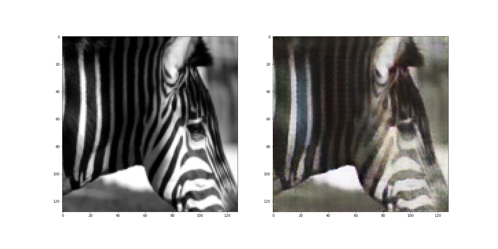
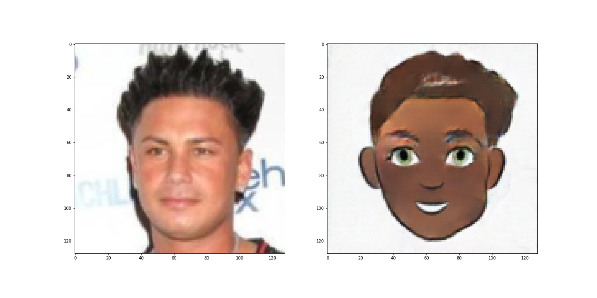
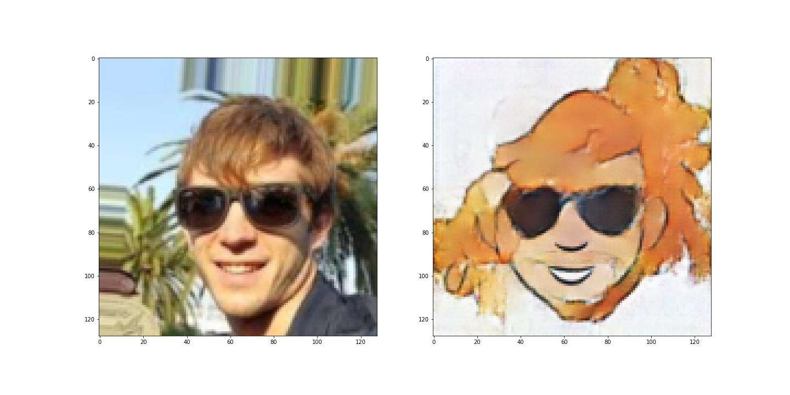

# Отчет по проекту
## Модели
За основу взята классическая CycleGAN из [https://arxiv.org/abs/1703.10593](https://arxiv.org/abs/1703.10593):

- [Генератор](src/model/generator.py): сеть с шестью Residual Blocks из статьи
- [Дискриминатор](src/model/discriminator.py): PatchGAN

Реализован [пул](src/utils/image_pool.py) для картинок с предыдущих эпох

В качестве Cycle и Identity лосса использовался L1Loss.

Для лоссов генератора и дискриминатора в основном использовался MSELoss, но для датасета horses2zebras также попробовал BCEWithLogitsLoss.

## Датасеты и результаты
### Датасет horses2zebras
**Цель:** превратить лошадь в зебру и обратно.

[Ссылка на скачивание датасета](https://people.eecs.berkeley.edu/~taesung_park/CycleGAN/datasets/horse2zebra.zip)

Ниже представлены графики лоссов и результаты обучения на тестовой выборке для разных лоссов генератора и дискриминатора. 

Число эпох = 200, learning rate = 0.0002

|       MSELoss   |BCEWithLogitsLoss|
|-----------------|-----------------|
|||
|||

В итоге, по субъективным оценкам, вариант с MSELoss был выбран как лучший.

#### Лучшие результаты на тестовой выборке
|Horse -> Zebra|Zebra->Horse|
|--------------|------------|
|||
|||
|||
|||

#### Худшие результаты на тестовой выборке
|Horse -> Zebra|Zebra->Horse|
|--------------|------------|
|||
|||
|||
|||

[Ссылка на результаты обучения с MSELoss](https://disk.yandex.ru/d/6gAcsqjiOVxkDw)

[Ссылка на результаты обучения с BCEWithLogitsLoss](https://disk.yandex.ru/d/sZVrJr8UprHikw)

### Датасет faces2k
**Цель:** сделать лицо человека "мультяшным".
Датасет собран из двух:
1. [CelebA dataset](https://mmlab.ie.cuhk.edu.hk/projects/CelebA.html), aligned&cropped
2. [Cartoon Set dataset](https://google.github.io/cartoonset/index.html)

Из каждого датасета взято по 2000 тренировочных и 200 тестовых изображений.

[Ссылка на датасет](https://disk.yandex.ru/d/PDjvBXxpyZzthA)

Ниже представлен график лоссов и результат на тестовой выборке после 200 эпох обучения с learning rate 0.0001

|Result|Loss|
|------|----|
|||

#### Лучшие результаты на тестовой выборке
|Face -> Cartoon|Cartoon->Face|
|--------------|------------|
|||
|||
|||
|||

#### Худшие результаты на тестовой выборке
|Face -> Cartoon|Cartoon->Face|
|--------------|------------|
|||
|||
|||
|||

[Ссылка на результаты обучения](https://disk.yandex.ru/d/hupte0YPwjbo3g)

## Бот
Для удобного использования натренированной модели был написан [бот](src/bot.py) в Telegram.

Бот доступен по [ссылке](https://t.me/CartoonFaceBot).
